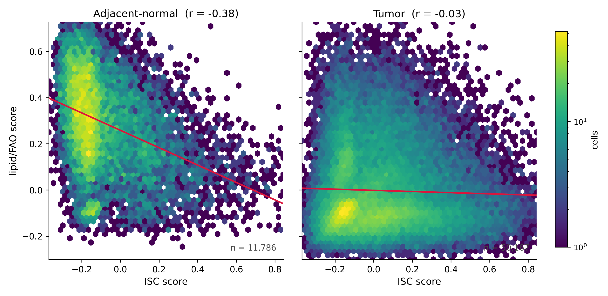
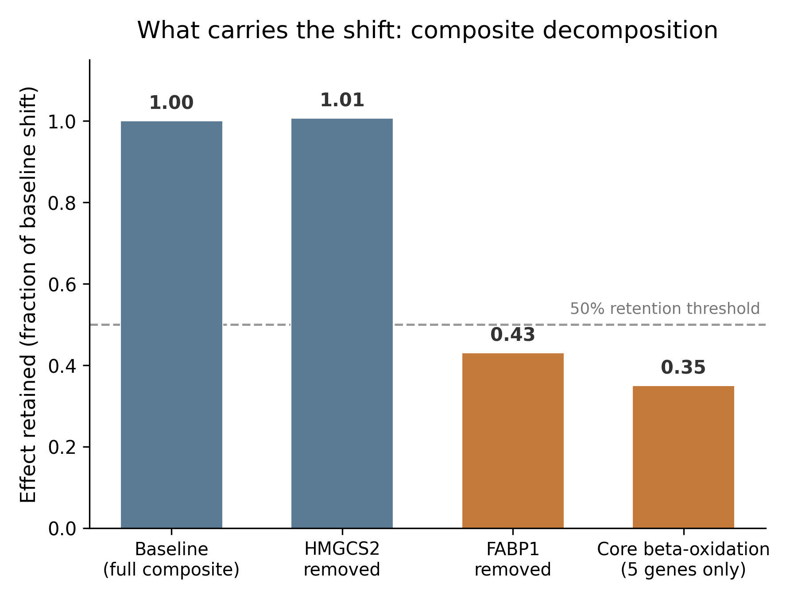
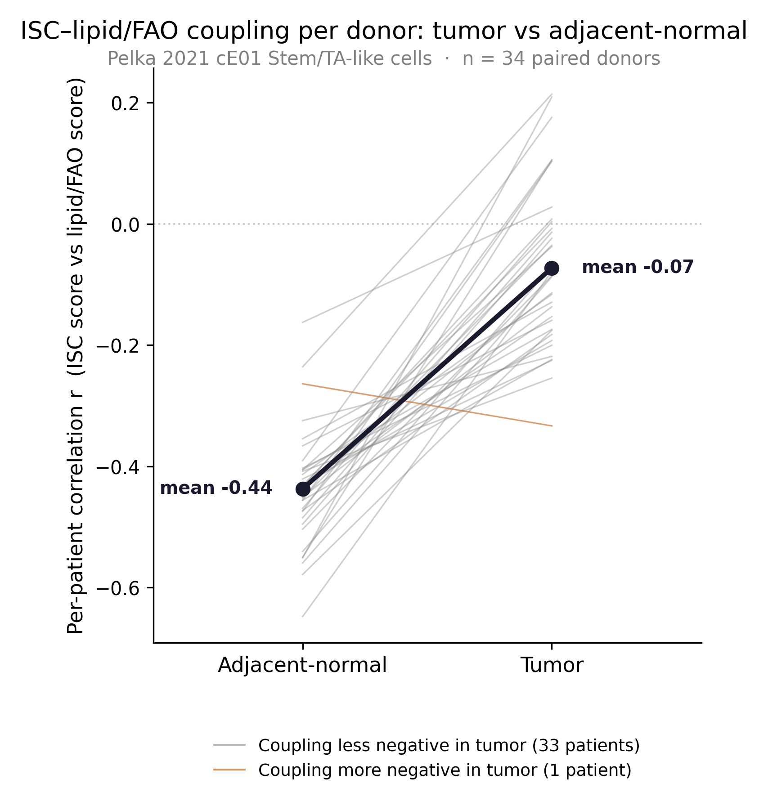

# crc-isc-lipid-coupling

Stemness and lipid/FAO transcriptional coupling in human colorectal-cancer Stem/TA-like epithelial cells.

## Summary

In mouse models, a high-fat diet expands intestinal stem and progenitor cells and increases tumorigenicity through a PPARδ/PPARα-associated fatty-acid-oxidation (FAO) and lipid-metabolism program. Whether a comparable relationship between stemness and lipid metabolism appears in human colorectal cancer is not yet known. This repository contains a donor-aware single-cell analysis of that question in the Pelka 2021 colorectal-cancer atlas.

The question it asks: within cE01 "Stem/TA-like" epithelial cells, does the cell-level relationship between an intestinal-stem-cell (ISC) score and a lipid/FAO-associated composite score differ between tumor and patient-matched adjacent-normal tissue, with the patient as the unit of analysis?

## What the analysis finds

In adjacent-normal tissue the ISC and lipid/FAO scores are inversely related; in tumor that inverse relationship is much weaker. Treating each patient as one observation, the mean per-patient correlation moves from `-0.437` in normal to `-0.073` in tumor. The donor-aware paired difference (Fisher-z) is `0.400629` (Wilcoxon p = `2.33 x 10⁻¹⁰`, 95% bootstrap CI `0.337` to `0.464`, `33` of `34` patients positive). The direction holds in `1,000` of `1,000` equal-cell downsampling draws and across four alternative analyses (AUCell `0.152`, z-score `0.207`, inverse-variance-weighted `0.386`, mixed-model `0.361`, QC-residualized `0.396`). The shift is robust and donor-consistent.

*Per-cell ISC score vs lipid/FAO score in cE01 cells. In adjacent-normal tissue the two are inversely related (r = -0.38); in tumor the relationship is nearly flat (r = -0.03). These are pooled cell-level correlations, shown for illustration; inference uses the donor-aware analysis below, and tissue and sequencing batch are perfectly confounded.*

What the shift is, specifically: a change in the correlation structure between the two scores. Decomposition shows it is carried mainly by FABP1, a lipid-binding and transport gene, rather than by a core β-oxidation sub-score, so it reflects a lipid-handling-associated state rather than a coherent FAO program. Tissue and sequencing batch are perfectly confounded in this cohort (Cramér's V = `1.000000`), so the effect is correlational, and it is established in a single cohort: Lee 2020 reproduces the normal-tissue anchor, but its annotation contains no tumor Stem/TA-like cells and so cannot test the tumor side. Full methodology, results, and limitations are in [`docs/REPORT.md`](docs/REPORT.md).

*Fraction of the baseline tumor-vs-normal shift retained under each variant. Removing FABP1, or restricting to a 5-gene core β-oxidation sub-score, drops the effect below the 0.50 retention threshold, while removing HMGCS2 does not. The signal is carried by FABP1, not by a coherent β-oxidation program.*

## Results at a glance

| Step | What it checks | Result |
|---|---|---|
| Inputs (Gate 1) | population, matrix, counts, eligibility | passed |
| Pooled scores (Gate 2/2b) | pooled cell-level correlation | normal `-0.382179` to tumor `-0.032731` (descriptive, not used for inference) |
| Donor-aware (Gate 4) | per-patient Fisher-z paired difference | Δz `0.400629`, p `2.33 x 10⁻¹⁰`, CI `0.337`–`0.464`, `33/34` positive |
| Robustness | 4 scoring methods, IVW, mixed-model, QC | direction consistent (AUCell `0.152`, z `0.207`, IVW `0.386`, mixed `0.361`, QC `0.396`) |
| Equal-cell (Gate 5) | 30 cells/patient/tissue, `1,000` draws | direction retained `1.000` |
| Decomposition (Gate 3) | leave-one-gene-out, core β-ox, FABP1/HMGCS2 | FABP1-driven (`0.430`), core β-ox does not carry (`0.350`) |
| LGR5 sensitivity (Gate 6) | circularity-free LGR5 subset | power-limited (`6` patients) |
| External (Lee 2020) | normal-anchor sign consistency | normal anchor negative in all 3 cohorts; tumor side not testable |

Three correlation quantities are kept separate throughout and should not be conflated: pooled cell-level r, the mean of per-patient r, and the donor-aware Fisher-z difference. Only the donor-aware quantity is used for inference.

*Per-patient ISC-lipid/FAO correlation, adjacent-normal vs tumor, for the 34 paired donors; the bold line is the mean, and 33 of 34 donors shift toward zero in tumor. This donor-aware, per-patient view is the basis for inference.*

## Repository

- `docs/REPORT.md` is the full write-up: methodology, step-by-step results, limitations, and references.
- `core_validation_v2/` holds the analysis scripts, result tables, and per-step provenance records.
- `core_validation_v2/audit/` holds the number ledgers (`CLAIMS_LEDGER.md`, `ROBUSTNESS_LEDGER.md`) and the independent reconstruction scripts that re-derive the results from source data.
- `figures/` holds the figures and the scripts that generate them from the committed result tables.

## Reproducibility

Environment: `scanpy 1.11.5`, `numpy 2.4.2`, `pandas 2.3.3`, `scipy 1.17.1`, `anndata 0.12.10`. Scores are computed with scanpy `score_genes` on the log-normalized matrix (`use_raw=False`, `ctrl_size=50`, `n_bins=25`, `random_state=42`). Each step writes a provenance record, and every number in the report traces to a committed ledger entry.

Data: Pelka et al. 2021 colorectal-cancer single-cell atlas. Epithelial compartment `168,295` cells; cE01 Stem/TA-like `61,953` cells (`50,167` tumor, `11,786` adjacent-normal); `34` paired donors with at least 30 cE01 cells in both tissues.

See `docs/REPORT.md` for the complete analysis.
